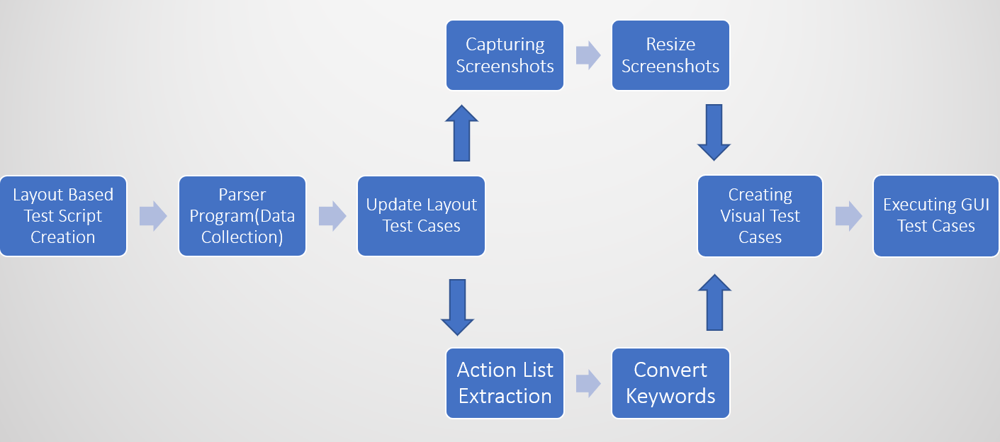
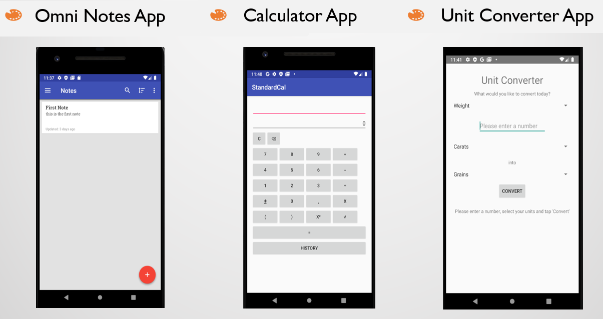
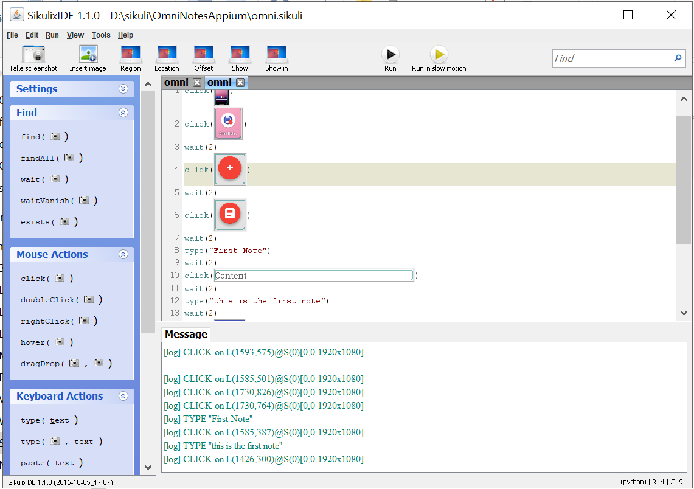

# Masters_Thesis
- This project translate the second generation layout based mobile testing test scripts into third generation GUI based test scripts. 

- The exiting layout based mobile testing test scripts written in java language are parsed through a java program(AddScreenshot.java), which looks for all the lines of code, which makes interaction in the mobile screen. For exampke, all the lines which contains - "driver.findElement". 
- After finding all the interactions, the test script is updated with a line of code -  addScreenshot(element) - before every line which were found in previous step. 
- Now, when the updated script is run, a screenhost of each element, [example](Master_Thesis/outputs/OmniNotesAppSikuli/OmniNotesAppium1GUI.sikuli/element0.png), is taken before the interaction of that particular element take place. -
- An action list is also maintained by extracting the actions from all the line of codes which perform some interaction. eg. click, sendKeys, assertTrue. 
- This action list is written into a text file, [example](Master_Thesis/outputs/CalculatorAppSikuli/calculatorAppium1GUI.sikuli/calculatorAppium1sikuli.txt) , with updated keywords according to the third generation visual based testing tool. In our case, Sikuli tool was used. So, accordingly the sendKeys is converted to 'type', while assertTrue is converted to 'exists'.
- At last when screenshots of all the elements and text file are collected and saved in one of sikuli folder, they are run through the sikuli tool, to examine how many scripts are executing successfully based on the result of the script in sikuli log. 

The experiment was conducted on three mobile applications:

All the test scripts were run through Sikuli tool for three apps (10 test scripts for each app). It was possible to convert all the 30 layout based test scripts into visual based GUI test scripts. A successful test execution in Sikuli tool looks like below:

Using below link you can see the presentation file for better understanding of the project. 

[Thesis_ppt](https://1drv.ms/p/s!Am3ut3u_p6QTiinZt5ueTKp9Ce0Z?e=Jk3zS2)
